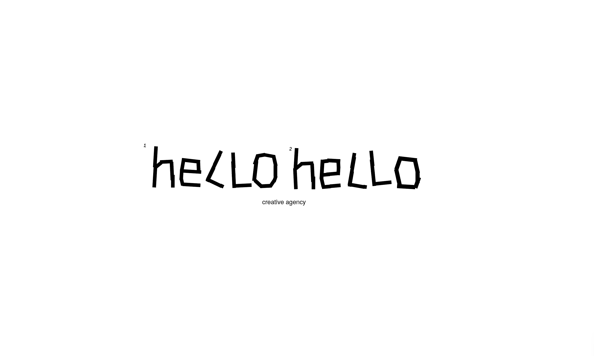

**[hellohello](https://www.instagram.com/hellohellocreative/)** is a creative agency focused on ideas, brands, vibes and experiences, based on people, sincerity and simplicity. 

We are a group of people united by core values and a diverse vision. 
We were made for people and their businesses. 

## Work

Our work includes projects in various communication areas.
Our capabilities include, but are not limited to:

* `Identity and Branding`            : How your brand should look
* `Brand or Communication Strategy`            : What to say about yourself
* `PR`            : Introduce yourself
* `Campaigns`            : Spread your vibe
* `Experience`            : Make people feel
* `Naming`            : What is your name
* `Copywriting`            : What you want to say
* `Brand Design`            : Your visual language
* `Voice + Messaging`            : How do you talk
* `Creative Consulting`            : Do it yourself right
* `Photo and Video Production`            : Create your vision
* `Website Development`            : Make people interact

## Example tag usage

## Header 1
### Header 2
#### Header 3
**bold**
*italic*

> blockquotes

~~~python
import os,time
print ("Biscuit")
~~~

## Licence and Author Information

Biscuit is derived from currently deprecated theme [Solo](http://github.com/chibicode/solo). The development of Biscuit is maintained by [Sefer Bora Lisesivdin](https://lrgresearch.org/bora).

Biscuit and the previous code where Biscuit is derived are distributed with [MIT license](https://github.com/sblisesivdin/biscuit/blob/gh-pages/LICENSE).
